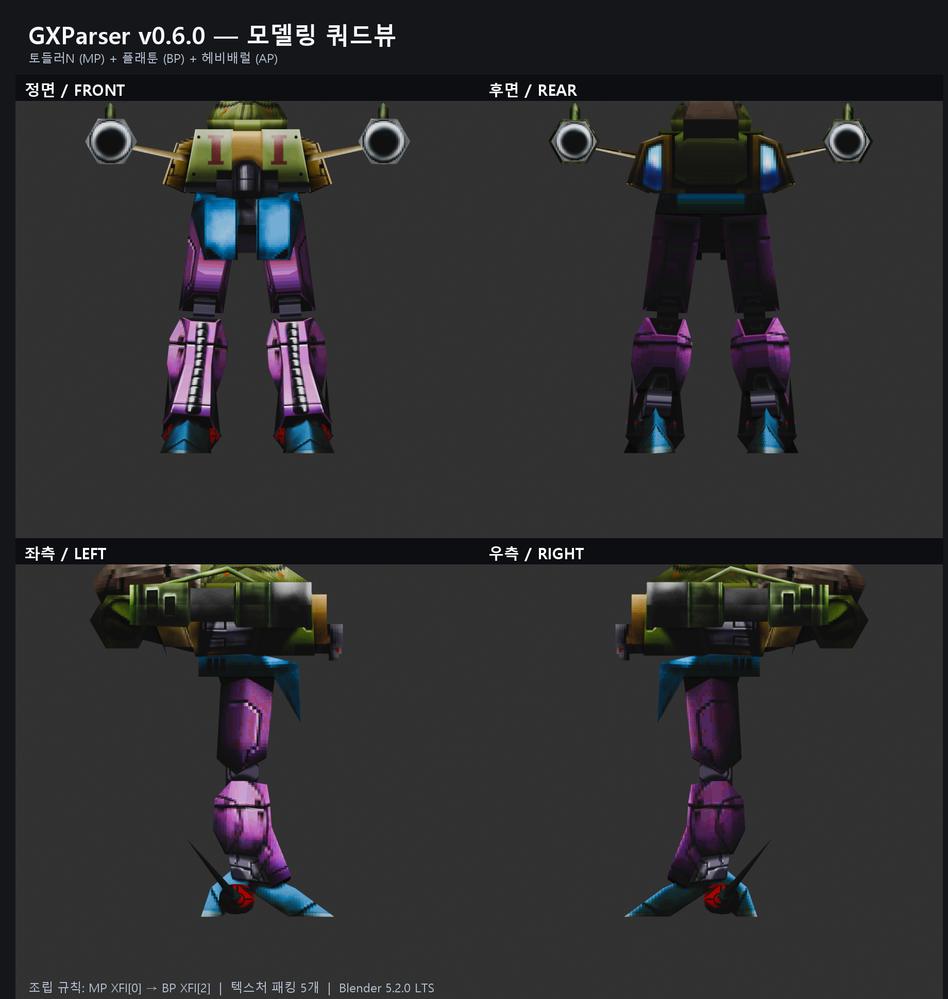

# Blender 임포터 사용 및 문제 해결

이 문서는 GXParser 정식 릴리스의 단일 파츠 임포터와 MP/BP/AP 복합 조립 임포터를 처음
사용하는 사람을 위한 안내서입니다. 검증 기준은 Blender 5.2.0 LTS와 GXParser v0.6.0입니다.

## 1. 설치

1. [Releases](https://github.com/labdebugcat/GXParser/releases)에서
   `GXParser-Blender-Addon-<version>.zip`을 받습니다.
2. Blender에서 `Edit > Preferences > Add-ons`를 엽니다.
3. 오른쪽 위 메뉴에서 `Install from Disk`를 선택해 ZIP을 지정합니다.
4. `GXParser Blender Importers`가 활성화되어 있는지 확인합니다.

ZIP 내부 폴더를 다시 압축하거나 파일 일부만 옮기면 모듈을 찾지 못할 수 있습니다. 릴리스
ZIP을 수정하지 않고 그대로 설치하는 방법을 권장합니다.

## 2. 단일 파츠 가져오기

1. `File > Import > Nova1492 GX/XFI (.gx)`를 선택합니다.
2. 가져올 `.gx` 파일 하나를 지정합니다.
3. 같은 폴더에 같은 이름의 `.xfi`가 있으면 변환과 action 정보도 함께 읽습니다.
4. 다른 PC로 `.blend`를 옮길 예정이라면 `Pack textures into .blend`를 켭니다.
5. 가져온 뒤 `Z > Material Preview`로 텍스처를 확인합니다.

GX만 있고 XFI가 없으면 메시 확인은 가능하지만 XFI 기반 action과 부착 정보는 사용할 수
없습니다.

## 3. MP/BP/AP 복합 조립

1. `File > Import > Nova1492 Assembled Unit (MP/BP/AP)`를 선택합니다.
2. MP에는 다리·이동 파츠 GX, BP에는 몸통 GX, AP에는 무기 GX를 지정합니다.
3. 임포터는 다음 확정 규칙으로만 조립합니다.

```text
BP world = MP world × MP visual root × MP XFI[0]
AP world = BP world × BP visual root × BP XFI[2]
```

AP 모양을 추측해 소켓을 바꾸거나 메시 중심을 맞추는 기능은 정식판에 없습니다. 조립이
이상하면 먼저 세 파일의 역할과 같은 이름의 XFI 존재 여부를 확인해야 합니다.

## 4. 검증 예시: 토들러N + 플래툰 + 헤비배럴



| 역할 | 표시 이름 | 실제 파일 | 가져온 메시 |
| --- | --- | --- | ---: |
| MP | 토들러N | `n_legs41_tdr.gx` | 13 |
| BP | 플래툰 | `body2_prt.gx` | 1 |
| AP | 헤비배럴 | `arm2_hbbr.gx` | 5 |

이 예시는 위치·회전 수동 보정 없이 `MP XFI[0] → BP XFI[2]`만 적용했습니다. 재질 5개와
텍스처 이미지 5개가 연결되었으며 이미지는 `.blend`에 패킹한 상태로 확인했습니다.

## 5. 오류 및 문제 해결

### 모델이 회색이고 텍스처가 안 보입니다

가장 흔한 원인은 가져오기 실패가 아니라 Blender의 뷰포트 표시 모드입니다. `Solid`에서는
재질 텍스처가 기본적으로 보이지 않습니다.

1. 마우스를 3D 뷰포트 위에 둡니다.
2. `Z`를 누릅니다.
3. `Material Preview`를 선택합니다.

그래도 보이지 않으면 `Shading` 작업 공간에서 재질의 `Image Texture` 노드가 Principled
BSDF의 Base Color에 연결됐는지 확인합니다. `File > External Data > Report Missing Files`에
파일이 나오면 원본 텍스처 경로가 끊어진 것입니다. 원본 GX와 텍스처의 상대적인 폴더
배치를 유지한 뒤 다시 가져오세요.

### 다른 PC에서 열었더니 분홍색으로 보입니다

분홍색은 Blender가 이미지 파일을 찾지 못한다는 표시입니다. 가져올 때
`Pack textures into .blend`를 켜거나, 저장 전에 `File > External Data > Pack Resources`를
실행하세요. 이미 경로가 끊어졌다면 원본 폴더를 복구한 뒤 `Find Missing Files`로 공통
폴더를 지정합니다.

### 흰색 재질 또는 일부 텍스처만 보입니다

- GX가 참조하는 `.tga` 또는 `.bmp`가 실제로 존재하는지 확인합니다.
- GX만 따로 복사하지 말고 관련 텍스처가 있는 클라이언트 폴더 구조를 유지합니다.
- Blender 시스템 콘솔의 `missing texture` 메시지에 표시된 정확한 파일명을 확인합니다.
- 대소문자를 구분하는 운영체제에서는 파일명의 대소문자도 일치해야 합니다.

### `MP XFI attachment matrix 0 missing` 오류가 납니다

선택한 MP GX와 같은 이름의 XFI가 없거나, 그 XFI에 첫 번째 부착 변환이 없습니다. MP로
사용할 파츠를 올바르게 선택했는지 확인하고 같은 줄기의 `.xfi`를 GX 옆에 둡니다.

### `BP XFI attachment matrix 2 missing` 오류가 납니다

선택한 BP가 표준 플레이어 몸통이 아니거나 XFI가 누락된 경우입니다. BP XFI에는 AP를
붙이는 세 번째 직렬화 변환이 있어야 합니다. AP 파일을 BP 칸에 넣지 않았는지도 확인합니다.

### 조립은 됐지만 파츠 위치가 이상합니다

다음 순서로 확인합니다.

1. MP/BP/AP 입력 칸에 각 역할의 GX를 정확히 넣었는지 확인합니다.
2. GX와 같은 이름의 XFI가 각각 존재하는지 확인합니다.
3. 과거 실험판이나 다른 애드온이 중복 설치되어 있지 않은지 확인합니다.
4. 릴리스 페이지의 최신 정식 ZIP을 다시 설치합니다.

수동 위치 보정, 메시 중심 정렬, AP 종류에 따른 소켓 0/2/3 추측은 검증에서 폐기된
방식입니다. 이러한 보정값을 적용한 장면은 정식 임포터 결과와 비교 기준으로 사용하지
마세요.

### 메뉴가 나타나지 않습니다

- Add-ons 목록에서 `GXParser Blender Importers`가 활성화됐는지 확인합니다.
- ZIP 안에 `nova1492_gx_importer/__init__.py`가 들어 있는지 확인합니다.
- 이전 버전을 비활성화·삭제한 뒤 Blender를 다시 시작하고 정식 ZIP을 설치합니다.
- Blender의 시스템 콘솔에 나온 Python 오류 전체를 확인합니다.

## 6. 문제를 제보할 때

원본 게임 파일을 GitHub에 첨부하지 마세요. 다음 정보만 제공하면 재현에 도움이 됩니다.

- GXParser와 Blender 버전
- MP/BP/AP 표시 이름과 파일명
- 오류 메시지 전문
- 각 GX/XFI의 파일 크기와 SHA-256
- `Solid`와 `Material Preview` 중 어떤 화면에서 확인했는지
- 가능하면 개인정보와 원본 자산이 포함되지 않은 화면 캡처
