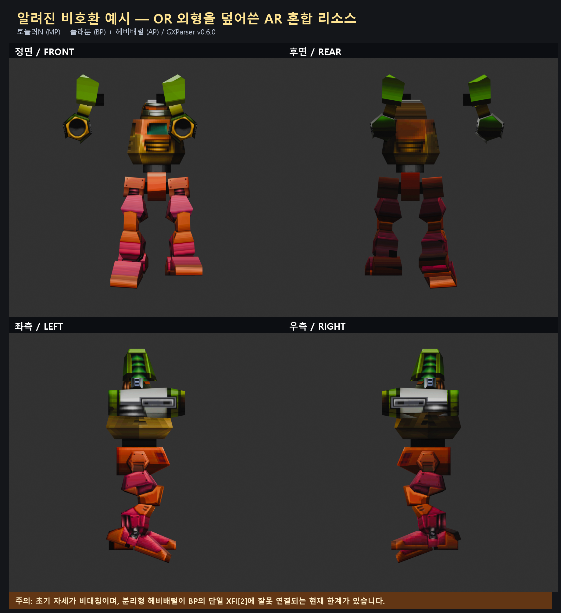

# 호환성 및 알려진 문제

## 현재 공식 지원 범위

GXParser v0.6.0은 현재 서비스 중인 **Nova1492AR의 정식 GX/XFI 모델 리소스**를 기준으로
구현하고 검증했습니다.

| 리소스 종류 | 현재 상태 |
| --- | --- |
| 현재 서비스 중인 Nova1492AR 정식 GX/XFI | 공식 지원 및 검증 대상 |
| 구 Nova1492 OR 원본 리소스 | 미지원 |
| OR 외형을 AR 파츠 리소스에 덮은 스킨용 혼합 리소스 | 미지원, 알려진 오조립 발생 |
| 개인 수정 GX/XFI | 미지원 |

확장자가 GX/XFI로 같거나 AR에서 실제로 로드할 수 있었다는 사실만으로 현재 임포터의 조립
계약과 호환된다는 의미는 아닙니다.

## 재현된 사례

아래 자료는 OR 파츠 외형을 사용하기 위해 AR 파츠 리소스 위에 OR 리소스를 덮어씌워
스킨처럼 사용하던 혼합 리소스입니다.

- MP: 토들러N / `n_legs41_tdr.gx`
- BP: 플래툰 / `body2_prt.gx`
- AP: 헤비배럴 / `arm2_hbbr.gx`
- 입력 위치: `Classic 25.04.03/common`
- 재현 버전: GXParser v0.6.0, Blender 5.2.0 LTS



이 그림은 정상 결과 예시가 아닙니다. 문제를 숨기거나 수동 위치 보정하지 않고 현재
임포터가 생성한 상태를 정면·후면·좌측·우측에서 기록한 것입니다.

## 확인된 문제

### 1. 하체 초기 자세가 중립 자세가 아님

혼합 리소스의 토들러N XFI에서 action ID 0은 GX 프레임 70~90을 가리킵니다. 현재
임포터는 ID 0을 초기 action으로 사용하므로 프레임 70의 비대칭 동작 자세가 첫 화면에
나타납니다.

```text
ID 0: 70~90
ID 1: 10~50
ID 2: 0~50
ID 4: 50~60
```

따라서 이 사례의 짝다리 모양은 메시 파싱 누락이 아니라, 혼합 리소스에 맞는 중립 action
판정 규칙이 아직 없어서 발생합니다.

### 2. 분리형 헤비배럴이 몸통 접속점을 사용하지 못함

혼합 리소스의 헤비배럴은 중앙 단일 메시가 아니라 좌우 가지가 분리된 구조입니다.

```text
merge_head
├─ merge_a → larm2.gx
└─ merge_b → rarm2.gx
```

플래툰 BP XFI에는 중앙점뿐 아니라 여러 좌우 대칭 변환 쌍이 들어 있습니다. 그러나 현재
정식 임포터는 AR 검증 계약에 따라 AP 전체를 단일 `BP XFI[2]`에 연결합니다. 이 때문에
좌우 가지가 각각의 접속점을 사용하지 못해 무기가 몸통에서 떨어지고 위치도 어긋납니다.

### 3. MP와 BP 연결

화면상 MP와 BP는 자연스럽게 연결되어 보이지만, 이 혼합 리소스 자체가 공식 지원 대상이
아니므로 네이티브 OR/혼합 런타임과 동일하다고 판정하지 않습니다.

## 현재 권장 사항

- 정상 모델 추출과 조립에는 현재 서비스 중인 Nova1492AR 정식 리소스를 사용하세요.
- 이 혼합 리소스 결과에 수동 오프셋을 더해 일반 규칙으로 저장하지 마세요.
- OR 및 혼합 리소스 지원은 action 의미와 좌우 AP 접속 분기를 별도로 검증한 뒤 추가해야
  합니다.
- 문제를 제보할 때는 정식 AR, OR 원본, OR-over-AR 혼합본 중 어떤 자료인지 반드시
  표시해 주세요.
