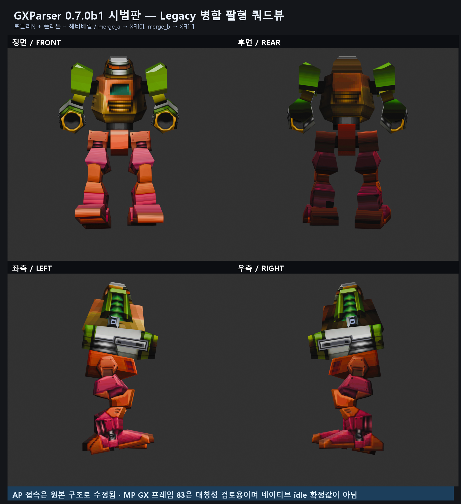

# GXParser 0.7.0b1 시범판

이 버전은 현재 AR과 Legacy 좌우 병합 팔형을 한 임포터에서 구분하는 기능을 검증하기 위한
프리릴리스입니다. 정식 v0.6.0을 대체하지 않습니다.

## 무엇이 바뀌었나

정식 v0.6.0은 AP 전체를 BP의 중앙 tower 소켓 `XFI[2]`에 연결합니다. 이 방식은 현재
서비스 중인 Nova1492AR의 검증된 리소스에는 그대로 유지됩니다.

시범판은 AP GX 안에서 다음 증거가 모두 발견되면 Legacy 병합 팔형으로 판정합니다.

- `merge_head`, `merge_a`, `merge_b` 노드가 모두 존재
- `merge_a`와 `merge_b` 양쪽 아래에 실제 메시가 존재
- 왼쪽 가지에 `larm`, 오른쪽 가지에 `rarm` 표식이 존재

판정되면 다음처럼 연결합니다.

```text
merge_a / larm 계층 → BP XFI[0] 왼쪽 arm
merge_b / rarm 계층 → BP XFI[1] 오른쪽 arm
```

병합 파일의 고정 `merge_b X=-0.6`을 몸통 소켓 간격으로 사용하지 않습니다. 각 몸통 XFI에
저장된 실제 좌우 접속 위치를 사용하므로 몸통별 간격 차이에 대응합니다.

## 무엇을 할 수 있나

- 현재 AR 정식 MP/BP/AP를 기존 중앙형 규칙으로 조립
- 명확한 `merge_a/larm + merge_b/rarm` Legacy AP를 좌우 arm 소켓에 조립
- 단일 GX의 메시, 재질, 텍스처와 XFI action 가져오기
- MP/BP/AP 각각 다른 원시 XFI Action ID 선택
- 텍스처를 `.blend` 안에 패킹
- 감지한 프로필과 실제 연결 요약을 Blender 결과 속성에 기록

## 설치

1. GitHub Releases에서 `GXParser-Blender-Addon-0.7.0b1.zip`을 받습니다.
2. Blender `Edit > Preferences > Add-ons > Install from Disk`를 선택합니다.
3. 받은 ZIP을 그대로 지정합니다.
4. 기존 버전과 충돌하면 기존 GXParser 애드온을 비활성화하거나 제거한 뒤 설치합니다.
5. Add-ons에서 `GXParser Blender Importers (Preview)`를 활성화합니다.

## 복합 조립 사용법

1. `File > Import > Nova1492 Assembled Unit (MP/BP/AP)`를 선택합니다.
2. MP, BP, AP GX를 각각 지정합니다.
3. `Assembly profile`은 우선 `Auto (recommended)`를 선택합니다.
4. MP/BP/AP Action ID는 각 XFI의 원시 숫자입니다. 같은 숫자가 같은 행동을 뜻한다고
   가정하지 마세요.
5. 다른 PC로 저장 파일을 옮길 경우 `Pack textures into .blend`를 켭니다.
6. 가져온 뒤 `Z > Material Preview`로 텍스처를 확인합니다.

### 프로필 선택

| 선택 | 동작 |
| --- | --- |
| Auto | 명확한 Legacy 좌우 병합 팔형을 감지하고, 나머지는 현재 AR 경로 사용 |
| Current AR | AP 전체를 BP XFI[2]에 연결. Legacy 병합 팔형이 감지되면 오조립 방지를 위해 중단 |
| Legacy merged arm pair | merge_a/merge_b를 XFI[0]/[1]에 연결. 구조 증거가 없으면 중단 |

## 검증 예시



사용한 로컬 리소스:

| 역할 | 파츠 | 파일 | 메시 |
| --- | --- | --- | ---: |
| MP | 토들러N | `n_legs41_tdr.gx` | 12 |
| BP | 플래툰 | `body2_prt.gx` | 1 |
| AP | 헤비배럴 | `arm2_hbbr.gx` | 10 |

Auto 모드가 `LEGACY_MERGED_ARM`을 감지하고 왼쪽/오른쪽 가지의 로컬 행렬이 각각 BP
XFI[0]/XFI[1]과 일치하는 것을 Blender 5.2.0 LTS에서 검사했습니다.

현재 AR 대표 조합 2개도 기존 메시 수와 BP/AP 위치가 v0.6.0 계약값과 동일함을 확인했습니다.
또한 현재 AR AP 근거 코퍼스 60개에서 Legacy 병합 팔형 서명과 충돌하는 파일이 0개임을
자동 검사합니다.

## 자세와 애니메이션 주의사항

이 시범판은 MP/BP/AP Action ID를 따로 선택할 수 있지만, Action ID의 행동명을 자동으로
확정하지 않습니다. 동일한 ID라도 파일마다 `[start, end)` 구간과 의미가 다를 수 있습니다.

예시 쿼드뷰의 토들러N은 MP Action ID 0의 원본 GX 프레임 83을 대칭성 검토용으로 표시한
것입니다. 프레임 83을 Classic 클라이언트의 네이티브 idle이라고 확정한 것이 아닙니다.

## 현재 제한과 주의사항

- 전체 OR 리소스를 지원하는 버전이 아닙니다.
- 어깨형 병합 AP의 XFI[3]/XFI[4] 분리는 아직 구현하지 않았습니다.
- 좌우가 별도 GX 파일인 AP pair 자동 탐색은 아직 구현하지 않았습니다.
- 이름이 손상되어 `larm/rarm`을 확인할 수 없는 병합 GX는 자동 조립하지 않습니다.
- 미확인 병합 구조에 수동 오프셋을 저장하지 않습니다.
- 현재 AR 회귀를 막기 위해 Legacy 구조를 Current AR로 강제하면 오류로 중단합니다.
- 모델이 회색이면 텍스처 누락으로 단정하지 말고 `Material Preview`를 확인하세요.

## 오류가 발생할 때

### `Merged AP structure ... ambiguous`

병합 노드는 있지만 좌우 역할을 확정할 증거가 부족합니다. 단일 파츠로 가져온 뒤 GX 계층과
파츠 Type을 조사해야 합니다.

### `Legacy merged arm requires BP XFI matrices 0 and 1`

선택한 BP에 좌우 arm 접속점이 없습니다. BP 파일이나 같은 이름의 XFI가 올바른지 확인합니다.

### `CURRENT_AR would attach it incorrectly`

Legacy 병합 팔형을 Current AR 중앙형으로 강제하려 한 경우입니다. Auto 또는 Legacy merged
arm pair를 선택하세요.

### 텍스처가 회색 또는 분홍색

- 회색: `Z > Material Preview` 선택
- 분홍색: 이미지 경로 누락. 원본 폴더 구조 복구 또는 `Find Missing Files` 사용
- 이동용 `.blend`: `Pack textures into .blend` 또는 `Pack Resources` 사용

## 정식 버전으로 승격하기 전 필요한 검증

- 더 많은 Legacy 팔형 병합 AP와 여러 BP 조합 교차검사
- 어깨형 병합 및 좌우 별도 GX pair 규칙 확정
- Classic 실행 파일 또는 실제 캡처를 통한 idle/action 의미 확인
- 현재 AR 전체 회귀검사 확대
